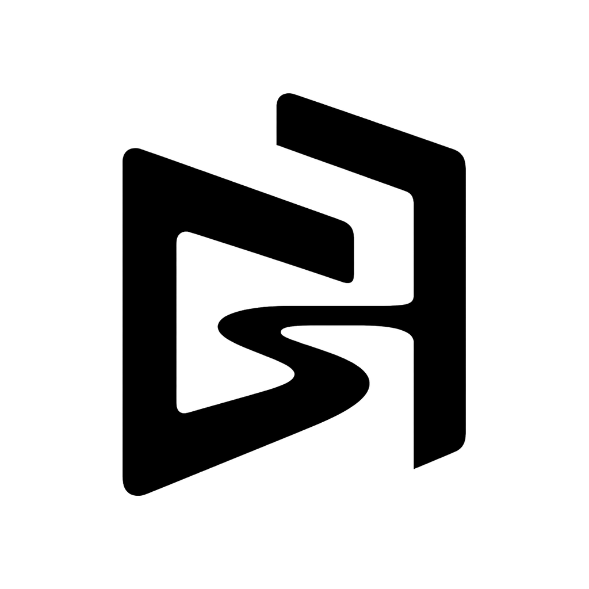
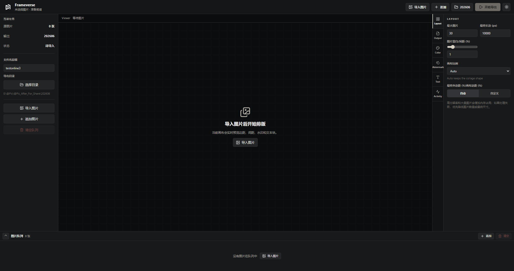

<p align="center">
  
</p>

<h1 align="center">Frameverse</h1>

Frameverse 是一款面向摄影师和内容创作者的 Windows/macOS 拼图排版工具。它可以将多张照片自动排列为网格拼图，添加留白、外边框、Logo 和文本，并按 Instagram、小红书等平台的封面比例导出高分辨率 JPEG。支持 JPEG、PNG、BMP、TIFF、HEIC/HEIF 等常见图片格式输入。

[下载最新版 Windows 安装包](https://github.com/Yuuichu/PicLayout/releases/latest)



## 主要功能

### 自动拼图排版

- 根据图片数量自动计算接近方形的行列布局。
- 图片保持原始比例，不拉伸、不变形。
- 支持单图留白、图片间距和最终画布外边距。
- 图片队列支持拖拽排序、前移、后移、旋转和移除。
- Rust + Rayon 并行处理，适合高分辨率照片和批量输出。

### 社交平台画幅预设

| 平台/用途 | 比例 |
|---|---:|
| Instagram 封面/网格 | 3:4 |
| Instagram 内容 | 3:4 |
| Instagram 经典竖图 | 4:5 |
| Instagram 方图 | 1:1 |
| Instagram 横图 | 1.91:1 |
| 小红书竖版 | 3:4 |
| 小红书方版 | 1:1 |
| 小红书横版 | 4:3 |
| 自定义画幅 | 自定义宽:高 |

`Auto` 保持拼图自身比例。选择平台预设后，最终画布会固定为目标比例。

默认使用“补边保全”策略：拼图会完整缩放并居中放入目标画布，剩余区域使用背景色填充，不裁掉照片内容。因此封面预览中可以看到完整拼图。

### Logo / Watermark

- 支持透明 PNG、HEIC/HEIF 等常见图片格式。
- 可调整缩放比例和 X/Y 坐标。
- 保留滑条与数字输入，也可以直接在 Viewer 中拖拽。
- 定位参照可独立选择：
  - `拼图区域`：切换画幅后，Logo 相对照片拼图的位置保持不变。
  - `整张画布`：Logo 相对最终输出画布的位置保持不变。
- 拼图区域坐标允许小于 `0%` 或大于 `100%`，可以将 Logo 放入最终外边框区域。

### 文本框

- 支持多行文本和系统字体。
- 可设置字体、字重、样式、字号、行高、最大宽度、内边距和对齐方式。
- 支持文字颜色、透明度、背景颜色和背景透明度。
- 与 Logo 一样支持滑条、数字输入和 Viewer 直接拖拽。
- 可独立选择“拼图区域”或“整张画布”作为定位参照。
- 切换画幅或定位参照时，会同步换算文本位置与尺寸，避免视觉跳动。

### 快速预览与精准预览

- 快速预览会随排版、比例、Logo 和文本参数实时更新。
- “生成精准预览”使用与正式导出相同的 Rust 图像管线。
- 精准预览会反映最终画布尺寸、图片位置、字体渲染、Logo 和色彩处理。
- 在精准预览上拖动 Logo 或文本时，会自动切回快速分层预览继续编辑。
- 导出完成后，Viewer 可以显示最终 JPEG 的实际结果。

### 输出质量与色彩

- 三种处理模式：标准高画质、极致高画质、快速预览。
- JPEG 质量可调。
- 支持 72、150、300、600 DPI。
- 支持 EXIF 自动旋正和手动 90 度旋转。
- 极致高画质模式支持线性光缩放。
- 支持 sRGB 输出或自定义 RGB ICC Profile。
- 支持 Perceptual 和 Relative Colorimetric 渲染意图。
- 可选白、黑、灰、浅灰、米色、浅蓝和浅黄背景。

## 使用方法

### 安装

1. 打开 [Releases](https://github.com/Yuuichu/PicLayout/releases/latest)。
2. 下载最新的 `Frameverse.Setup.<version>.exe`。
3. 运行安装程序并选择安装目录。

当前安装包面向 Windows x64。安装包未进行商业代码签名，Windows SmartScreen 可能显示安全提示。

### 基本工作流

1. 点击“导入图片”选择照片。
2. 在底部图片队列中调整顺序或旋转方向。
3. 在 `Layout` 中设置图片留白、最终长边、画布比例和外边距。
4. 在 `Watermark` 和 `Text` 中启用 Logo 或文本，并选择定位参照。
5. 使用滑条、数字输入或直接拖拽调整位置。
6. 点击“生成精准预览”检查最终效果。
7. 设置文件名前缀和导出目录。
8. 点击“开始导出”生成 JPEG。

## 参数说明

| 参数 | 默认值 | 说明 |
|---|---:|---|
| 最大图片 | 40 | 单次任务允许导入的最大图片数量 |
| 内容长边 | 40% | 单张照片内容长边相对最终长边的比例 |
| 单图边框 | 1% | 每个拼图单元四周的留白 |
| 图片间距 | 0% | 拼图单元之间的横向/纵向间隔 |
| 画布比例 | Auto | 自动比例、平台预设或自定义比例 |
| 最终外边距 | 自动 | 自动按列数计算，也可输入自定义百分比 |
| 最终长边 | 10000 px | 最终输出画布的长边尺寸 |
| JPEG 质量 | 95 | JPEG 编码质量，范围 1-100 |
| DPI | 300 | 写入 JPEG 的输出分辨率 |
| 背景色 | 白色 | 拼图留白和最终画布背景颜色 |

高分辨率、大量图片、极端自定义比例或较大的外边距会增加内存占用。处理失败时，可优先降低图片数量或最终长边。

## 输出文件

没有 Logo 和文本时：

```text
{prefix}_collage_final.jpg
```

启用 Logo 或文本时：

```text
{prefix}_collage_final_watermarked.jpg
```

程序直接生成最终成品，不会保留中间拼图文件。若部分源图片无法读取，任务会报告失败图片和警告信息。

## 从源码运行

需要：

- Windows 10/11 x64 或 macOS
- [Rust](https://rustup.rs)
- Node.js 22.12-24（推荐 Node.js 22 LTS）
- macOS 打包额外需要 Xcode 和 CMake

```bash
# 编译 Rust 核心
cd rust-core
cargo build --release

# 启动 Electron 开发环境
cd ../electron-app
npm install
npm run dev
```

也可以使用项目脚本：

```bash
bash scripts/dev.sh
```

## 测试与打包

```bash
# Rust 单元测试
cd rust-core
cargo test

# Electron 生产构建
cd ../electron-app
npm run build

# Windows NSIS 安装包
npm run electron:build
```

完整构建脚本：

```bash
bash scripts/build.sh
```

安装包输出到 `dist-electron/`。

### macOS 打包

在 macOS 上安装依赖后执行：

```bash
# Apple Silicon
bash scripts/build-macos.sh arm64

# Intel
bash scripts/build-macos.sh x64
```

脚本会编译与目标架构一致的 Rust sidecar，并生成 DMG 和 ZIP。未配置 Developer ID 时会使用 ad-hoc 签名，产物仅适合本机测试；公开分发需要 Developer ID 签名和 Apple notarization。完整步骤见 [macOS 打包说明](docs/macos-packaging.md)。

## 项目架构

```text
rust-core/          Rust 图像处理核心
electron-app/
  main/             Electron 主进程与 Rust sidecar 管理
  preload/          安全 IPC API
  renderer/         Vue 3 + Pinia 用户界面
scripts/            开发和构建脚本
PicsLayout_V8.py    保留的 Python/Tkinter 版本
```

通信链路：

```text
Vue Renderer -> Electron IPC -> Rust stdin
Rust stdout NDJSON -> Electron IPC -> Vue Renderer
```

## License

[MIT](LICENSE)
